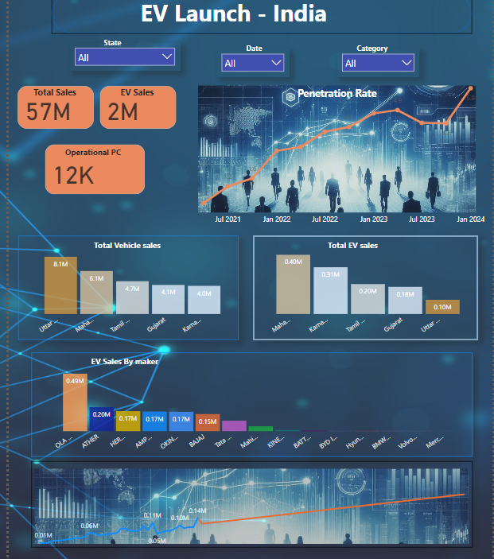
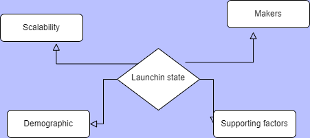

&nbsp;&nbsp;&nbsp;&nbsp;I recently received a requirement from one of my clients, a leading UK-based automotive company, looking to expand into the Indian electric vehicle (EV) market. The objective was to provide data-driven insights to support their decision-making process for launching EV operations in India. Inspired by this project, I am now working on a similar initiative with an imaginary company named AtliQ Autmotive

## Project Overview :

<h3>Objective:</h3> To analyze the EV environment in India over the last 4 years and provide strategic insights to help Atliq Automobiles identify the most suitable states for launching its EV branch.

### Scope:
The analytics will guide the management in deciding which state is ideal for starting operations, based on various performance and market penetration parameters.

### Dashboard 

## Data Collection:
Sources: Data was gathered from multiple reliable sources, including the [Pariahana](https://vahan.parivahan.gov.in/vahan4dashboard/vahan/view/reportview.xhtml), [EV Ready Dashboard](https://evreadyindia.org/ev-sales/), and additional datasets from Kaggle.

Key Data Points:
 a. Total vehicle sales (state-wise)
 b. Electric vehicle (EV) 
 c. sales by state and category (both 2-wheeler and 4-wheeler categories)
 d. Competitor data 

## Data Modification
### Data Cleaning: 
Python was employed for data transformations, and Power Query was used for handling null values and other inconsistencies

### Challenges Solved:
I used the FuzzyWuzzy library to standardize irregular maker names to match with respective states, ensuring accurate data merging.
Null values were cleaned up using Power Query, improving the dataset’s reliability.

## Analysis Techniques:
The goal of the dashboard was to present insights that would help identify the most promising state for the EV launch. Key parameters, including total sales and EV penetration rates, were analyzed using trend lines and predictive techniques. The concept for identifying the ideal state is illustrated in the chart below.

  

### Tools: 
Power BI for data visualization, Excel for minor modifications, and Python for major data transformations.

## Key Findings:
The analysis highlighted the top 5 states in terms of total vehicle and EV sales over the past 4 years.
Predictive analysis helped forecast sales trends for the next 5 years, giving valuable insights into future market potential.

## Recommendations:
Based on the analysis, I recommended Karnataka and Maharashtra as the best states to launch the EV branch, considering their strong sales performance and market potential.

## Challenges & Learnings:
This project presented numerous challenges, but it was also a rich learning experience. I learned to:

Tackle complex data problems using AI tools and techniques.

Leverage information from various sources effectively.

Adapt AI to accelerate problem-solving and project completion.

## Conclusion:
This project not only provided actionable insights for a successful EV launch in India but also helped me grow as a data analyst by navigating challenges and harnessing AI’s power to deliver a quality solution.

